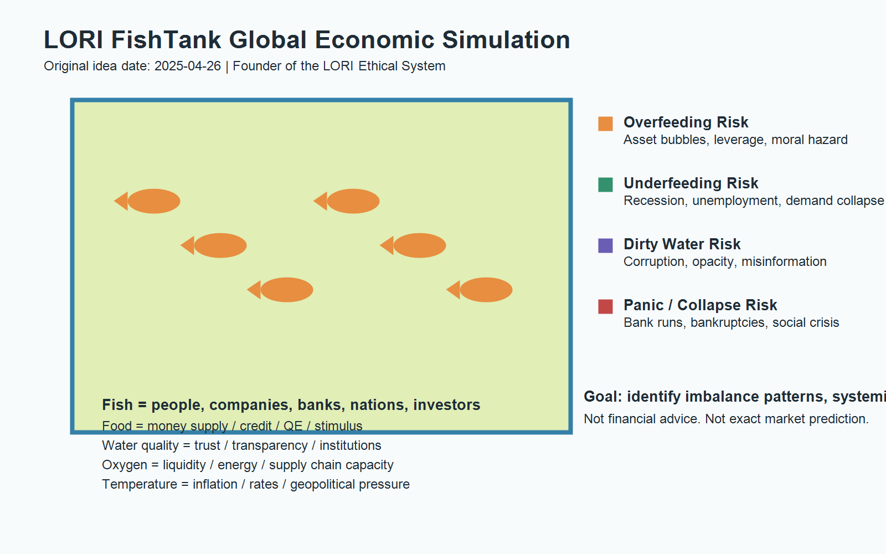

# LORI-FishTank-GlobalEconomicSimulation

A symbolic economic simulation framework using fish tank ecology to model global liquidity, trust, resource allocation, inflation, systemic imbalance, and crisis formation.

以魚缸生態作為全球經濟具象模型，模擬流動性、信任、水質、資源投放、通膨與系統性危機形成。

## Concept Provenance

Original idea date: 2025-04-26

This concept was previously posted publicly on social platforms with timestamped records as evidence of prior publication and authorship. Public traceable posting records exist prior to repository creation, and cross-platform publication records were preserved before GitHub archival.

Attribution: Founder of the LORI Ethical System.



## 概念來源

原始想法日期：2025-04-26

此概念先前已在社群平台公開發布，並保留具時間戳的公開紀錄，作為先前發布與作者來源證明。可公開追溯的發布紀錄早於 GitHub 倉庫建立，跨平台發布紀錄已在 GitHub 歸檔前保存。

署名：Founder of the LORI Ethical System。

## Fish Tank Metaphor

The model treats a fish tank as a symbolic global economic system. Fish represent people, companies, banks, nations, and investors. Fish food represents money supply, credit, subsidies, QE, stimulus, and resource allocation. Water quality represents trust, institutional stability, transparency, and social confidence.

The purpose is to observe imbalance patterns, not to predict exact GDP, stock prices, exchange rates, or asset values. The framework is a systemic simulation layer for exploring how liquidity, trust, inflation pressure, resource distribution, and behavioral panic can interact before crisis formation.

## 魚缸隱喻

此模型將魚缸視為全球經濟系統的具象隱喻。魚代表人民、企業、銀行、國家與投資者。魚飼料代表貨幣供給、信用、補貼、量化寬鬆、刺激政策與資源投放。水質代表信任、制度穩定、透明度與社會信心。

此框架的目的不是精準預測 GDP、股價、匯率或資產價格，而是觀察失衡模式。它是一個系統性模擬層，用於探索流動性、信任、通膨壓力、資源分配與群體恐慌如何在危機形成前互相作用。

## Core Mapping

| Fish Tank Ecology | Economic Meaning |
| --- | --- |
| Fish Tank | Global economic system |
| Fish | People, companies, banks, nations, investors |
| Fish food | Money supply, credit, subsidies, QE, stimulus, resource allocation |
| Water quality | Trust, institutional stability, transparency, social confidence |
| Oxygen | Liquidity, energy, supply chain capacity |
| Water temperature | Inflation, interest rates, geopolitical pressure |
| Overfeeding | Asset bubble, debt expansion, leverage, greed, moral hazard |
| Underfeeding | Unemployment, recession, demand collapse, social unrest |
| Dirty water | Corruption, opacity, misinformation, broken trust |
| Fish panic/death | Bank runs, bankruptcies, social instability, financial crisis |

## 核心對照

| 魚缸生態 | 經濟含義 |
| --- | --- |
| 魚缸 | 全球經濟系統 |
| 魚 | 人民、企業、銀行、國家、投資者 |
| 魚飼料 | 貨幣供給、信用、補貼、量化寬鬆、刺激政策、資源投放 |
| 水質 | 信任、制度穩定、透明度、社會信心 |
| 氧氣 | 流動性、能源、供應鏈承載能力 |
| 水溫 | 通膨、利率、地緣政治壓力 |
| 過度餵食 | 資產泡沫、債務擴張、槓桿、貪婪、道德風險 |
| 餵食不足 | 失業、衰退、需求崩塌、社會不安 |
| 髒水 | 腐敗、不透明、錯誤資訊、信任破裂 |
| 魚群恐慌或死亡 | 銀行擠兌、破產、社會不穩、金融危機 |

## Risk Assessment Layer

This project includes a risk assessment layer for evaluating liquidity risk, overfeeding risk, water quality risk, temperature shock risk, behavioral panic risk, resource misallocation risk, and systemic collapse risk.

See [docs/Risk_Assessment.md](docs/Risk_Assessment.md).

## 風險評估層

本專案包含一個風險評估層，用於評估流動性風險、過度餵食風險、水質風險、水溫衝擊風險、行為恐慌風險、資源錯配風險與系統性崩潰風險。

請參閱 [docs/Risk_Assessment.md](docs/Risk_Assessment.md)。

## Model Boundary

This framework is conceptual, educational, and exploratory. It is not financial advice, investment advice, or an official economic forecast.

It should not be treated as a precise GDP prediction model, stock prediction model, trading signal, policy directive, or investment recommendation. The goal is to detect imbalance, systemic fragility, and early crisis signals.

## 模型邊界

此框架屬於概念性、教育性與探索性模型。它不是財務建議、投資建議，也不是官方經濟預測。

它不應被視為精準 GDP 預測模型、股價預測模型、交易訊號、政策指令或投資建議。其目標是識別失衡、系統脆弱性與早期危機訊號。

## Repository Structure

```text
README.md
ORIGIN_STATEMENT.md
LICENSE
docs/
  FishTank_Economic_Model.md
  Variable_Mapping_Table.md
  Simulation_Logic.md
  Crisis_Scenarios.md
  Governance_UseCases.md
  Risk_Assessment.md
assets/
  FishTank_Society_Stability_Model_04262025.png
examples/
  Overfeeding_Crisis_Simulation.md
  Underfeeding_Recession_Simulation.md
  WaterQuality_TrustCollapse_Simulation.md
```

## License

This repository uses a custom restrictive license. Public viewing and personal study are allowed, but commercial use, AI training, dataset extraction, model fine-tuning, and derivative system integration require written permission. Attribution to Founder of the LORI Ethical System must remain intact.

## 授權

本倉庫採用自訂限制性授權。允許公開瀏覽與個人研究，但商業使用、AI 訓練、資料集擷取、模型微調與衍生系統整合皆需取得書面許可。Founder of the LORI Ethical System 的署名必須保持完整。
